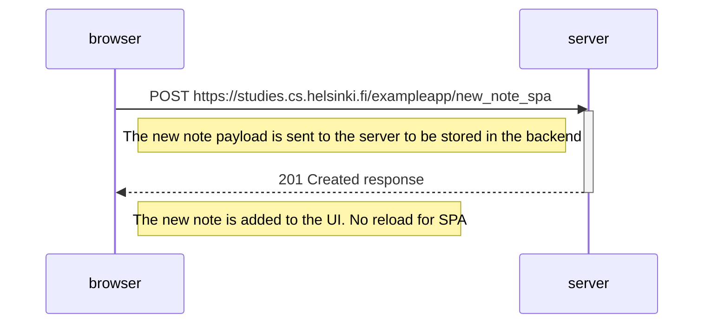

```mermaid
sequenceDiagram
    participant browser
    participant server

    browser->>server: POST https://studies.cs.helsinki.fi/exampleapp/new_note_spa
    activate server
    Note left of server: The new note payload is sent to the server to be stored in the backend
    server-->>browser: 201 Created response
    deactivate server 

    Note right of browser: The new note is added to the UI.  No reload for SPA
```
